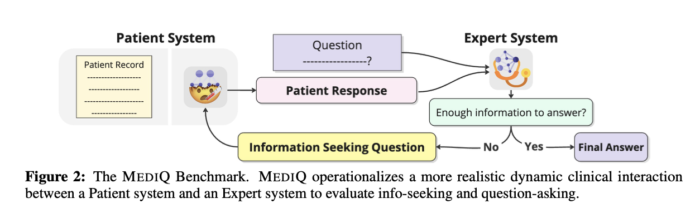
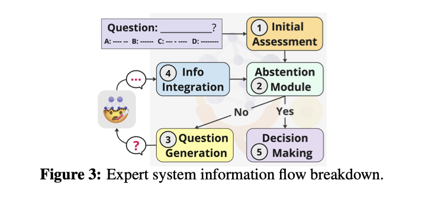
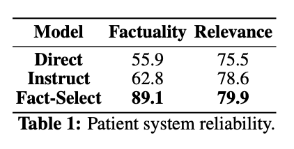
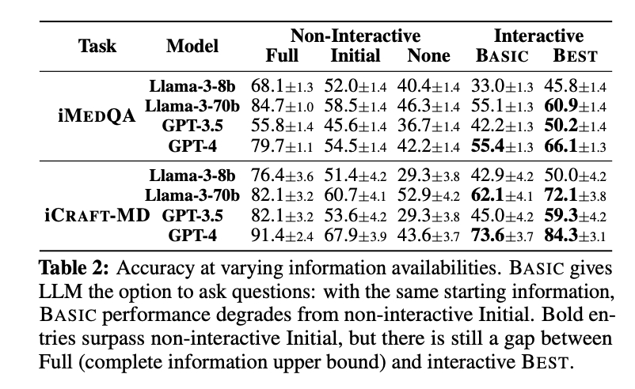

# MediQ: Question-Asking LLMs and a Benchmark for Reliable Interactive Clinical Reasoning

Current LLM benchmarks evaluate models in static, single-turn formats, not suited for interactive tasks. The authors introduce [MediQ](https://openreview.net/pdf?id=W4pIBQ7bAI), a benchmark for simulating interactive clinical scenarios where LLMs ask follow-up questions to gather missing information. Results show that directly prompting LLMs to ask questions degrades performance. But if **abstention strategies** are used to gauge confidence, diagnostic accuracy improves by 22.3%. Despite this, performance still lags behind an ideal scenario with complete information. The study also finds that filtering irrelevant context and reformatting conversations improves interactive performance.

## Problem: Static QA benchmarks
A critical issue with current general-purpose large language models (LLMs) is that, it isn't quite suitable for  real-world decision-making scenarios, such as clinical conversations. Traditional medical question-answering (QA) benchmarks are static and assume all necessary information is provided upfront. It is unrealistic in many situations. In real clinical interactions, users often provide incomplete information, and effective decision-making requires follow-up questions to clarify missing details. The problem is that LLMs are designed for single-turn interactions. They struggle to proactively seek missing information, potentially leading to harmful general responses instead of informed decisions.

## Solution: MediQ

1. **Interactive Benchmark:** MediQ shifts the paradigm from static QA to an interactive format. In this way, an Expert system (doctor’s assistant) asks follow-up questions to a Patient system (simulating a patient) to gather missing information. This simulates more realistic clinical interactions where context is incomplete.

  
2. **Improved Information-Seeking:** MediQ uses state-of-the-art LLMs to benchmark their ability to ask dynamic, information-seeking questions. It also introduces novel confidence estimation strategies (e.g., **rationale generation** and **self-consistency**) to help the Expert system decide when to ask questions or provide answers. This addresses the gap in LLMs' ability to effectively interact and seek missing information in complex scenarios.

## How MEDIQ works:

1) **The Patient System:**

The Patient system in MediQ simulates a real patient in clinical consultations. It has access to a complete patient record, including symptoms, medical history, and lifestyle factors. It is designed to respond coherently and accurately to follow-up questions from the Expert system. The system’s performance is evaluated based on two criteria: factuality (whether the responses match the patient record) and relevance (whether the responses answer the expert’s question). Three variants are proposed:  
- **Direct:** A baseline where the Patient directly responds based on the provided patient record.
- **Instruct:** The Patient is instructed to only answer based on the record, refraining when the information is unavailable.
- **Fact-Select:** The Patient selects relevant atomic facts from the record to answer the question.

2) **The Expert System:**

The Expert system simulates the medical decision-making process, iteratively seeking additional information and updating its diagnosis. The system begins with limited patient data and assesses if it's sufficient for a final answer. If uncertain, it asks follow-up questions. The system's performance is evaluated based on **efficiency** (number of follow-up questions) and **accuracy** (final diagnosis). The Expert system operates through five steps: **Initial Assessment**, **Abstention** (deciding when to abstain and ask questions), **Question Generation**, **Information Integration**, and **Decision Making**. Multiple abstention strategies (e.g., **Binary**, **Numerical**, **Rationale Generation**, **Self-Consistency**) are tested to improve the system's confidence in its answers.

## Results:

1 **Reliability of the MediQ Patient System**
The MediQ Patient system is evaluated in three settings: Direct, Instruct, and Fact-Select. The Direct and Instruct settings struggle with factuality, with the former sometimes giving vague answers like "Yes" or "No" instead of atomic facts. The Instruct setting also generates inferences instead of sticking strictly to the patient record. However, the Fact-Select setting, which uses atomic facts, significantly improves factuality (by 0.33 points) and relevance (by 0.04 points). This shows that using atomic facts reduces hallucinations and enhances response accuracy and relevance.

2 **Performance of Non-Interactive LLMs with Limited Information**
LLMs perform worse as the available patient information decreases. In the BASIC interactive setup, models are expected to ask questions. In this setup, accuracy drops by 11.3% compared to non-interactive models with the same initial information. Most models do not ask any questions indicating poor proactive information-seeking ability. Larger models tend to ask more questions and perform better. But all models struggle with limited information, highlighting the challenge of integrating information from continuous interactions.

3 **Impact of Asking Questions on Performance**  
Incorporating Abstention Modules (e.g., Numerical, Scale, Rationale Generation) significantly improves model performance. The Scale Abstention method combined with Rationale Generation and Self-Consistency boosts accuracy by 22.3% over the BASIC setup and by 12.1% over the non-interactive setup. However, even the best configuration only closes 51.2% of the gap between non-interactive and full-information scenarios, indicating room for further improvement.

## Limitations and Future Directions: 

The main limitations include the scarcity of detailed medical datasets, reliance on a paid API for the Patient system, and the use of a multiple-choice format in the evaluation. Future work should focus on creating open-source Patient systems, collecting open-ended datasets, and extending MediQ for more flexible evaluation.

## Conclusion:

To address the gap in current LLMs' ability to seek information in personalised settings, MediQ benchmark has been introduced for evaluating question-asking capabilities in clinical scenarios with incomplete information. It has been noticed that, state-of-the-art LLMs like Llama-3 and GPT-4 struggle with this task. MediQ has higher performance, a system with better confidence judgment and medical expertise. MediQ encourages interactive, transparent clinical reasoning. It suggests future research to enhance the system by integrating more diverse patient systems and expanding medical knowledge for healthcare applications.
